<p align="center">
  
</p>

<h1 align="center">skovanniy</h1>

<p align="center">
  <b>OBSID TEAM</b> · code, security, automation, and dark-glass interfaces
</p>

<p align="center">
  
  
  
</p>

```txt
SKOVANNIY // OBSID TEAM
> building sharp tools
> breaking noisy problems into clean systems
> shipping with style
```

### About

I build clean, sharp, and useful things: automation, security-minded tools, bots, interfaces, and experiments.

### Stack / Interests

`Python` · `JavaScript` · `TypeScript` · `Node.js` · `Git` · `Linux` · `Automation` · `Security`

### Contact

Open to team projects, experiments, and collabs under **OBSID TEAM**.
